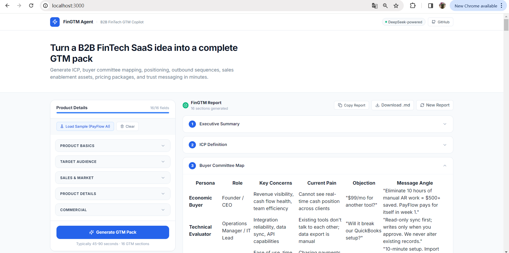

# FinGTM Agent

> **Built by [Becky Dai](https://github.com/beiqidai) and [Alice Liu](https://github.com/aliceliudev)**

**B2B FinTech GTM Copilot** — Turn a product idea into a complete, investor-ready go-to-market strategy in minutes.



---

## Overview

FinGTM Agent is a full-stack AI Agent web application built for early-stage B2B SaaS FinTech founders, product marketers, SDRs, and BDR teams. It takes structured product information and generates a 16-section, immediately deployable GTM and sales enablement package — not generic marketing copy.

Unlike general-purpose AI writing tools, FinGTM Agent is built around the actual mechanics of B2B enterprise selling: buying committees, procurement friction, security reviews, ICP qualification, and pipeline-stage messaging.

**Input:** One product brief (16 fields).  
**Output:** A complete GTM pack — positioning, outbound sequences, sales scripts, pricing, trust messaging, and a 30-day launch plan.

---

## Why This Exists

Early-stage FinTech teams waste weeks building GTM assets manually, often without the B2B enterprise sales expertise to make them effective. FinGTM Agent compresses that work into minutes, grounded in real B2B logic:

| Challenge | What FinGTM Agent Solves |
|---|---|
| Who actually buys the product | Identifies Economic Buyer, Champion, Technical Evaluator, Procurement — separately |
| Why companies buy *now* | Buying trigger analysis tied to company growth stage |
| How to displace Excel, Xero, Stripe | Competitive displacement messaging and objection scripts |
| What slows enterprise deals | Security, compliance, integration, and budget objection handling |
| How SDRs should reach out | Cold emails, LinkedIn sequences, and voicemail scripts ready to use |
| How AEs should run discovery | Structured discovery questions by topic, with follow-up flows |
| How to price for conversion | Tiered packaging with upgrade triggers and sales notes |
| What you can and cannot claim in FinTech | Security and trust messaging with compliance risk warnings |

---

## Product Demo


*Fill in your product details on the left. The AI generates a full GTM pack on the right — 16 sections, ready to use.*

---

## Features

- **16 GTM sections** generated from a single product brief
- **B2B sales logic baked in** — buyer committee mapping, ICP definition, objection handling
- **FinTech-aware** — security messaging, compliance warnings, trust language guidance
- **DeepSeek-powered** — uses DeepSeek via OpenAI-compatible API, no OpenAI key required
- **Professional B2B SaaS UI** — Next.js, Tailwind CSS, Framer Motion, shadcn/ui primitives
- **Collapsible section cards** with copy-to-clipboard and Markdown download
- **Sample data included** — one-click PayFlow AI demo product
- **API key stays in backend** — never exposed to the browser

---

## Generated GTM Sections

| # | Section | What You Get |
|---|---|---|
| 1 | Executive Summary | Product snapshot, GTM recommendation, commercial risks and opportunities |
| 2 | ICP Definition | Firmographics, budget signals, urgency signals, disqualification criteria |
| 3 | Buyer Committee Map | 5 personas: Economic Buyer, Technical Evaluator, Daily User, Champion, Procurement |
| 4 | Pain-to-Value Mapping | Current pain → business impact → product capability → value message → proof needed |
| 5 | Positioning | One-sentence positioning, category, 3 alternative angles, differentiation, why now |
| 6 | Landing Page Copy | Full English copy: hero, problem, solution, features, trust, FAQ, CTA |
| 7 | SDR / BDR Outbound Sequence | 3 cold emails + 3 LinkedIn messages + 3 voicemail scripts + personalisation tokens |
| 8 | LinkedIn ABM Content | 20 posts: founder voice, company page, thought leadership, buyer pain |
| 9 | Sales One-Pager | Print-ready one-page sales document in English |
| 10 | Discovery Call Questions | 9 topic areas, 3–5 questions each |
| 11 | Demo Script | Opening, demo flow, objection moments, closing CTA |
| 12 | Objection Handling | 8 common objections with analysis (Chinese) and response scripts (English) |
| 13 | Pricing Packaging | Starter / Growth / Pro with upgrade triggers and sales notes per tier |
| 14 | Security & Trust Messaging | What to claim, what not to claim, trust phrases, security FAQ, compliance warnings |
| 15 | 30-Day GTM Launch Plan | Week-by-week tasks, deliverables, and success metrics |
| 16 | Next Version Suggestions | Product and GTM improvements for the next roadmap cycle |

---

## Tech Stack

| Layer | Technology |
|---|---|
| Frontend | Next.js 14 (App Router), TypeScript, Tailwind CSS, Framer Motion, react-markdown |
| Backend | Python 3.11, FastAPI, OpenAI Agents SDK (`openai-agents`) |
| AI Model | DeepSeek V3 via OpenAI-compatible API |
| UI Primitives | Radix UI, lucide-react, class-variance-authority |

---

## Project Structure

```
FinGTM Agent/
├── README.md
├── Homepage.png
├── .gitignore
├── backend/
│   ├── main.py          # FastAPI app, CORS config, /api/generate-gtm-pack endpoint
│   ├── agent.py         # DeepSeek agent setup, system prompt, GTM prompt builder
│   ├── schemas.py       # Pydantic input/output models (ProductInput, GTMResponse)
│   ├── requirements.txt
│   └── .env.example
└── frontend/
    ├── package.json
    ├── next.config.js
    ├── tailwind.config.ts
    ├── app/
    │   ├── layout.tsx       # Root layout + metadata + Google Fonts
    │   ├── page.tsx         # Main page — idle / loading / success / error state machine
    │   └── globals.css      # Tailwind base + custom markdown prose styles
    ├── components/
    │   ├── AppShell.tsx         # Top navigation bar + hero headline
    │   ├── ProductInputForm.tsx # 16-field input form grouped into 5 collapsible sections
    │   ├── GTMReport.tsx        # Report toolbar + markdown section parser
    │   ├── ReportSection.tsx    # Collapsible card with react-markdown renderer
    │   ├── LoadingState.tsx     # 12-stage animated loading progress
    │   ├── EmptyState.tsx       # Pre-generation empty state with feature cards
    │   ├── ErrorState.tsx       # Error display with debug checklist
    │   ├── CopyButton.tsx       # Copy full report to clipboard with visual feedback
    │   └── DownloadButton.tsx   # Download report as .md file
    └── lib/
        ├── types.ts       # Shared TypeScript interfaces
        ├── api.ts         # Fetch client for backend with timeout and error handling
        └── sampleData.ts  # PayFlow AI demo product pre-filled data
```

---

## Getting Started

### Prerequisites

- [Anaconda](https://www.anaconda.com/) or Miniconda
- [Node.js](https://nodejs.org/) 18+
- A [DeepSeek API key](https://platform.deepseek.com)

---

### Backend Setup

**Step 1 — Create Conda environment**

```powershell
conda create -n fingtm-agent python=3.11 -y
conda activate fingtm-agent
```

**Step 2 — Install dependencies**

```powershell
cd backend
pip install -r requirements.txt
```

**Step 3 — Set your DeepSeek API key**

```powershell
# Windows PowerShell (session)
$env:DEEPSEEK_API_KEY = "your_deepseek_api_key_here"
```

Or create a `.env` file in `backend/`:
```
DEEPSEEK_API_KEY=your_deepseek_api_key_here
```

**Step 4 — Start the backend**

```powershell
uvicorn main:app --reload --port 8000
```

Verify: `http://localhost:8000/health` → `{"status":"ok","deepseek_key_configured":true}`

---

### Frontend Setup

**Step 1 — Install dependencies**

```powershell
cd frontend
npm install
```

**Step 2 — Start the dev server**

```powershell
npm run dev
```

Open: **http://localhost:3000**

---

## Testing with Sample Data

1. Start the backend (`uvicorn main:app --reload --port 8000`)
2. Start the frontend (`npm run dev`)
3. Open **http://localhost:3000**
4. Click **"Load Sample (PayFlow AI)"** — auto-fills all 16 fields
5. Click **"Generate GTM Pack"**
6. Wait 60–120 seconds for the full report to generate
7. Browse section cards, copy content, or click **"Download .md"** to export

---

## Common Errors

| Error | Cause | Fix |
|---|---|---|
| `DEEPSEEK_API_KEY is not configured` | Missing env variable | Run `$env:DEEPSEEK_API_KEY = "sk-..."` before starting uvicorn |
| `Cannot connect to backend` | uvicorn not running | Run `uvicorn main:app --reload --port 8000` in the backend directory |
| `Cannot connect to backend` after page load | Backend reloaded due to file change | Wait 3 seconds and click Generate again |
| `Authentication failed` | Wrong or expired API key | Verify key at platform.deepseek.com |
| `Model not found` | Wrong model name | Confirm `model="deepseek-chat"` in `backend/agent.py` |
| Frontend shows blank page | Stale `.next` build cache | Delete `frontend/.next` folder and restart `npm run dev` |
| Report stops before section 16 | Model output token limit | `max_tokens=16000` is already set in `agent.py` |

---

## Security Notes

- `DEEPSEEK_API_KEY` is read server-side only — it is never sent to the browser
- All AI calls go through the FastAPI backend — the frontend never calls DeepSeek directly
- CORS is restricted to `http://localhost:3000` — update `allow_origins` in `main.py` for production
- No database, no authentication — this is a local development and demo tool
- Do not submit real customer PII through this tool
- `.env` is in `.gitignore` — never commit your API key

---

## Codebase Orientation

Read these files in order to understand the full system:

| File | What It Teaches You |
|---|---|
| `backend/schemas.py` | The data contract — 16 input fields in, markdown + success flag out |
| `backend/agent.py` | How the AI agent is configured and what it is instructed to generate |
| `backend/main.py` | FastAPI endpoint, error classification, CORS setup |
| `frontend/lib/types.ts` | TypeScript interfaces shared across all frontend components |
| `frontend/app/page.tsx` | Four-state machine: idle → loading → success → error |
| `frontend/components/ProductInputForm.tsx` | 16-field form grouped into 5 collapsible sections |
| `frontend/components/GTMReport.tsx` | How the markdown output is parsed into individual section cards |

---

## Roadmap

| Feature | Status |
|---|---|
| 16-section GTM report generation | Done |
| Sample data (PayFlow AI) | Done |
| Markdown copy + download | Done |
| Collapsible section cards | Done |
| Streaming output (show report as it generates) | Planned |
| PDF export | Planned |
| Section-by-section generation with progress bar | Planned |
| Competitor analysis agent | Planned |
| Vertical modes (Payments, Lending, Treasury, InsurTech) | Planned |
| CRM export (HubSpot, Salesforce) | Planned |
| Landing page builder | Planned |
| Team collaboration + saved reports | Planned |

---

## Authors

Built by **Becky Dai** and **Alice Liu**.

---

*FinGTM Agent is a portfolio and demonstration project. All generated GTM content is AI-generated and should be reviewed by a qualified GTM practitioner before use in production sales or marketing workflows.*